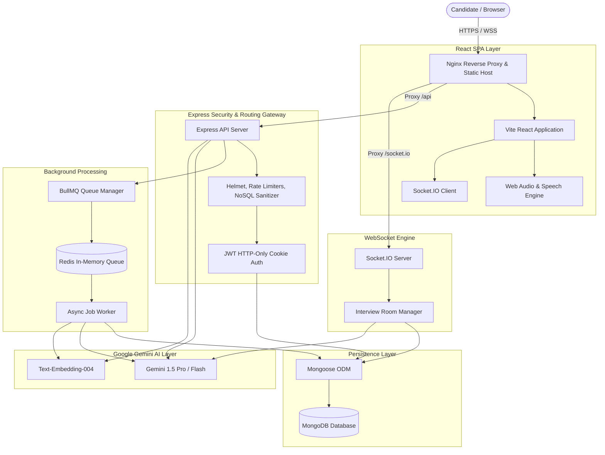

# CareerAI — AI Career & Interview Intelligence Platform

[](https://github.com/)
[](https://github.com/)
[](https://www.docker.com/)
[](LICENSE)

An enterprise-grade, full-stack AI career intelligence and real-time mock interview simulator built on the MERN stack, WebSockets, Redis, BullMQ, and Google Gemini 1.5.

---

## Table of Contents
1. [Project Overview](#1-project-overview)
2. [Problem Statement](#2-problem-statement)
3. [Features](#3-features)
4. [Technology Stack & Architectural Trade-Offs](#4-technology-stack--architectural-trade-offs)
5. [System Architecture](#5-system-architecture)
6. [System Architecture Diagram (Mermaid)](#6-system-architecture-diagram)
7. [Database Architecture](#7-database-architecture)
8. [AI Architecture & Pipelines](#8-ai-architecture--pipelines)
9. [RAG Workflow (Retrieval-Augmented Generation)](#9-rag-workflow)
10. [Dense Embedding Workflow](#10-dense-embedding-workflow)
11. [Autonomous Agent & Tool-Calling Workflow](#11-autonomous-agent--tool-calling-workflow)
12. [Authentication & Session Security](#12-authentication--session-security)
13. [Real-Time WebSocket Architecture](#13-real-time-websocket-architecture)
14. [Voice AI & Speech Architecture](#14-voice-ai--speech-architecture)
15. [Background Job Architecture (Redis & BullMQ)](#15-background-job-architecture)
16. [Security Considerations & Hardening](#16-security-considerations--hardening)
17. [API Documentation](#17-api-documentation)
18. [Environment Variables](#18-environment-variables)
19. [Local Development Setup](#19-local-development-setup)
20. [Docker & Containerized Setup](#20-docker--containerized-setup)
21. [Automated Testing Strategy](#21-automated-testing-strategy)
22. [Production Deployment Instructions](#22-production-deployment-instructions)
23. [Future Improvements](#23-future-improvements)

---

## 1. Project Overview

**CareerAI** is a full-stack SaaS platform designed to transition candidates from technical interview preparation to hiring success. It integrates multi-format resume ingestion (PDF/DOCX), dense vector embeddings (768-dim), deterministic resume-to-job matching, grounded RAG career assistance, real-time voice and text mock interviews over WebSockets, autonomous AI mentoring with persistent memory, and automated 4-week learning roadmaps.

---

## 2. Problem Statement

Technical job seekers struggle with:
1. **Opaque ATS Systems**: Inability to know whether resumes will pass applicant tracking filters.
2. **Generic Interview Practice**: Static LeetCode/DSA problems that fail to replicate real-world behavioral and system architecture discussions.
3. **LLM Hallucinations in Prep Tools**: AI coaching tools that invent arbitrary scores or hallucinate job requirements.
4. **Lack of Personalized Roadmaps**: One-size-fits-all tutorials that ignore an individual candidate's specific skill gaps.

---

## 3. Features

* **ATS Resume Intelligence**: Ingests `.pdf` and `.docx` files, parses technical skills, evaluates ATS compliance, and generates dense vector embeddings.
* **Job Description Intelligence**: Parses target job postings, isolates core engineering deliverables, and extracts required vs preferred skills.
* **Deterministic Semantic Matcher**: 3-tier algorithm combining structured skill overlap ($45\%$), vector cosine similarity ($40\%$), and seniority ($15\%$) to eliminate LLM score hallucinations.
* **Production RAG Assistant**: Multi-tenant grounded question answering querying top-$K$ vector chunks from user resumes and job postings.
* **Voice & WebSocket Mock Interviews**: Real-time mock interview studio featuring adaptive difficulty, speech-to-text transcription, Web Audio soundwaves, speaking pace analysis (WPM), and spoken feedback.
* **AI Career Mentor with Tools & Memory**: Autonomous coaching agent equipped with 7 deterministic safe tools and persistent memory.
* **Personalized Learning Roadmaps**: 4-week structured milestones generated from real candidate weaknesses with interactive progress tracking.
* **Background Queue Processing**: Offloads heavy AI text extraction and dense embedding generation to Redis and BullMQ.
* **Complete Security Hardening**: Helmet CSP, HTTP-Only cookies, NoSQL injection sanitizers, rate limiters, and prompt injection boundaries.

---

## 4. Technology Stack & Architectural Trade-Offs

| Technology | Purpose | Why It Was Used | Alternatives Considered & Trade-Offs |
|---|---|---|---|
| **Node.js & Express** | Backend API & WebSocket Gateway | Non-blocking event loop, unified JavaScript runtime with React, rich AI SDK ecosystem. | **FastAPI (Python)**: Great for ML, but introduces dual-runtime operational overhead. **Go**: Fast, but lacks native JSON schema sharing with frontend. |
| **MongoDB & Mongoose** | Primary Document & Vector Store | Native JSON/BSON document model supports complex AI evaluations and dynamic schemas. | **PostgreSQL (pgvector)**: Excellent relational integrity, but document mutation on nested AI arrays is more verbose. |
| **Google Gemini 1.5** | Core LLM & Embeddings Engine | 1M+ token context window, structured JSON output mode, low latency, dense 768-dim embeddings (`text-embedding-004`). | **OpenAI GPT-4o**: High capability, but significantly higher API token cost. **Local Llama 3**: High GPU infrastructure cost. |
| **Socket.IO** | Real-Time Bi-Directional WebSockets | Built-in room clustering, automatic reconnection, and heartbeat health checks. | **Native WebSockets (`ws`)**: Lacks built-in room clustering and fallback logic. **SSE**: Unidirectional only. |
| **Redis & BullMQ** | In-Memory Message Broker & Queues | Asynchronous job processing, exponential backoff retries, and job status polling. | **RabbitMQ/Kafka**: Overkill for single-cluster workloads. **In-memory setTimeout**: Vulnerable to process crashes. |
| **React & Vite** | Frontend SPA | Instant HMR, tree-shaking, lightweight production bundle, and modern component architecture. | **Next.js**: Great for public SEO, but CareerAI is a private dashboard SPA where SSR adds unnecessary server load. |

---

## 5. System Architecture

CareerAI follows a modular, decoupled full-stack architecture:
* **Client Tier**: Vite React SPA with dark-mode SaaS styling and Web Audio visualizers.
* **Reverse Proxy Tier**: Nginx container handling static asset delivery, SPA routing (`try_files $uri /index.html`), and proxying `/api/` and `/socket.io/`.
* **Application Tier**: Express.js API gateway and Socket.IO WebSocket server.
* **Worker Tier**: BullMQ background workers processing asynchronous resume text extraction and embedding generation.
* **Persistence Tier**: MongoDB Atlas / local cluster and Redis in-memory cache.

---

## 6. System Architecture Diagram



---

## 7. Database Architecture

* **`users`**: Stores candidate profiles, bcrypt hashed passwords ($\ge 10$ rounds), target job roles, and platform roles.
* **`resumes`**: Stores extracted resume text, structured contact/experience/education data, and ATS scores.
* **`jobs`**: Stores target job postings, canonicalized required skills, and core responsibilities.
* **`vectorchunks`**: Stores 768-dimensional dense vector embeddings with metadata and `userId` scoping.
* **`interviews`**: Stores mock interview sessions, questions, candidate answers, and 6-dimensional evaluation scorecards.
* **`roadmaps`**: Stores 4-week structured milestones and topic progress completion states.
* **`memories`**: Stores candidate growth patterns and recurring weaknesses for the AI Mentor.

---

## 8. AI Architecture & Pipelines

1. **Structured Outputs via Zod**: Every LLM prompt mandates JSON output conforming to strict Zod runtime schemas (`EvaluationSchema`, `ATSAnalysisSchema`, `RoadmapSchema`).
2. **Adaptive Interview Engine**: Dynamically shifts interview difficulty (Easy $\rightarrow$ Medium $\rightarrow$ Hard) or injects diagnostic questions when candidate scores $<65\%$ in a specific topic.
3. **Numerical Scoring Protection**: Numerical scores are derived deterministically in backend algorithms rather than relying on generative hallucinations.

---

## 9. RAG Workflow

```
[Candidate Query] ──► [Embed Query via text-embedding-004] ──► [Vector Search in MongoDB]
                                                                        │
[Grounded AI Response] ◄── [Gemini 1.5 LLM] ◄── [Format Top-5 Chunks in <retrieved_context>]
```

1. Query is embedded into a 768-dim vector.
2. Cosine similarity retrieves top-5 user-owned chunks.
3. Chunks are framed inside `<retrieved_context>` blocks with anti-override directives.
4. Gemini generates a grounded response referencing specific source documents.

---

## 10. Dense Embedding Workflow

* **Chunk Size**: $500$ characters with $100$-character sliding overlap.
* **Embedding Model**: Google `text-embedding-004` (768 dimensions).
* **Storage**: Saved in `VectorChunk` collection with compound index on `{ userId: 1, documentType: 1 }`.

---

## 11. Autonomous Agent & Tool-Calling Workflow

The AI Career Mentor uses an autonomous tool loop over a **frozen, prototype-free tool registry** (`Object.create(null)`):
1. `getUserResume(userId)` — Retrieves candidate skills and experience.
2. `getJobDescription(jobId, userId)` — Fetches requirements for target roles.
3. `getSkillGaps(resumeId, jobId, userId)` — Calculates real-time skill parity.
4. `getInterviewHistory(userId)` — Analyzes past mock interview performance.
5. `getSkillProgress(userId)` — Tracks topic mastery progression.
6. `getLearningRoadmap(userId)` — Returns active 4-week milestones.
7. `getGitHubProfile(userId)` — Reads candidate project records.

---

## 12. Authentication & Session Security

* **Token Storage**: JSON Web Tokens stored in `httpOnly: true`, `secure: true`, `sameSite: 'lax'`/`'none'` cookies.
* **Password Hashing**: `bcryptjs` with 10 salt rounds; excluded from query projections via `select: false`.
* **Multi-Tenant Protection**: Every controller enforces strict `userId: req.user._id` query filtering.

---

## 13. Real-Time WebSocket Architecture

* **Protocol**: Socket.IO over WebSockets with HTTP polling fallback.
* **Authentication**: JWT handshake verification.
* **Room Isolation**: Candidates join private rooms `interview:${id}` verified against database ownership.
* **Events**: `startInterview`, `submitAnswer`, `aiThinking`, `questionReady`, `answerEvaluated`, `scoreUpdated`, `interviewCompleted`.

---

## 14. Voice AI & Speech Architecture

* **Microphone Input**: Captured via browser `navigator.mediaDevices.getUserMedia()`.
* **Visualizer**: Web Audio `AudioContext` and `AnalyserNode` generating live soundwaves.
* **Transcription**: Web Speech Speech-to-Text with speaking pace calculation (Words Per Minute / WPM).
* **AI Speech Synthesis**: Text-to-Speech audio response.
* **Ethical Guardrails**: Focuses strictly on communication clarity without pseudo-scientific psychological claims.

---

## 15. Background Job Architecture

* **Queue Engine**: BullMQ backed by Redis.
* **Queues**: `resume-processing`, `embedding-ingestion`, `roadmap-generation`.
* **Retry Strategy**: 3 attempts with exponential backoff ($1000\text{ms} \rightarrow 2000\text{ms} \rightarrow 4000\text{ms}$).
* **Progress Tracking**: Monitored via `GET /api/jobs/status/:jobId` ($20\% \rightarrow 50\% \rightarrow 80\% \rightarrow 100\%$).

---

## 16. Security Considerations & Hardening

* **HTTP Headers**: Helmet CSP, `X-Frame-Options: SAMEORIGIN`, `X-Content-Type-Options: nosniff`.
* **Rate Limiting**: `authLimiter` (250 req/15m), `aiLimiter` (300 req/10m), `apiLimiter` (1000 req/15m).
* **NoSQL Injection**: `sanitizationMiddleware.js` recursively strips `$` query operators.
* **Secret Leak Audit**: Zero API keys exposed in frontend bundles.

---

## 17. API Documentation

| Method | Endpoint | Auth | Description |
|---|---|---|---|
| `POST` | `/api/auth/register` | Public | Register user account |
| `POST` | `/api/auth/login` | Public | Authenticate user & set JWT cookie |
| `POST` | `/api/auth/logout` | Protected | Clear session cookie |
| `POST` | `/api/resumes/upload` | Protected | Ingest and parse PDF/DOCX resume |
| `POST` | `/api/jobs` | Protected | Create and parse target job posting |
| `POST` | `/api/jobs/:id/match-resume/:resumeId` | Protected | Deterministic 3-tier resume-to-job match |
| `POST` | `/api/ai/rag/query` | Protected | Query grounded career RAG engine |
| `POST` | `/api/interviews` | Protected | Generate adaptive mock interview |
| `POST` | `/api/interviews/:id/start` | Protected | Start mock interview session |
| `POST` | `/api/interviews/:id/answer` | Protected | Submit interview answer for 6-dim scoring |
| `POST` | `/api/ai/mentor/chat` | Protected | Conversational mentor with tool calling |
| `POST` | `/api/roadmaps/generate` | Protected | Generate 4-week learning roadmap |
| `GET` | `/api/analytics` | Protected | Aggregated career readiness telemetry |

---

## 18. Environment Variables

Create `.env` based on `.env.example`:

```ini
# Server & Runtime
NODE_ENV=production
PORT=5000
CLIENT_URL=http://localhost:5173

# Database & Redis
MONGODB_URI=mongodb://127.0.0.1:27017/careerai
REDIS_HOST=127.0.0.1
REDIS_PORT=6379
REDIS_URL=redis://127.0.0.1:6379

# Security & Secrets
JWT_SECRET=your_super_secret_jwt_key_2026_minimum_32_chars
JWT_EXPIRE=30d
JWT_COOKIE_EXPIRE=30

# AI Provider
GEMINI_API_KEY=your_google_gemini_api_key_here
```

---

## 19. Local Development Setup

### Prerequisites
* Node.js v18+
* MongoDB running locally on `27017`
* Redis running locally on `6379` (optional; mock fallback available)

### Step 1: Install Backend & Frontend Dependencies
```bash
# In backend directory
cd backend
npm install

# In frontend directory
cd ../frontend
npm install
```

### Step 2: Configure Environment
```bash
cp .env.example .env
```

### Step 3: Run Backend Server
```bash
cd backend
node server.js
```

### Step 4: Run Frontend Dev Server
```bash
cd frontend
npm run dev
```
Open **`http://localhost:5173`** in your browser.

---

## 20. Docker & Containerized Setup

Build and run the entire 4-container stack (Frontend, Backend, MongoDB, Redis) with a single command:

```bash
# Copy environment configuration
cp .env.example .env

# Build and start all services
docker compose up --build -d

# Check running container health
docker compose ps
```

* **Frontend**: `http://localhost:5173`
* **Backend API & Health**: `http://localhost:5000/api/health`
* **MongoDB**: `mongodb://localhost:27017/careerai`
* **Redis**: `redis://localhost:6379`

---

## 21. Automated Testing Strategy

### Backend Master Suite (15 Test Suites)
```bash
cd backend
npm test
```
Executes all 15 test suites sequentially (`test_auth.js`, `test_resume.js`, `test_ai_analyzer.js`, `test_jobs.js`, `test_semantic.js`, `test_matcher.js`, `test_rag.js`, `test_interview.js`, `test_interview_flow.js`, `test_mentor.js`, `test_roadmap_analytics.js`, `test_socket_interview.js`, `test_voice_interview.js`, `test_background_jobs.js`, `test_security_audit.js`).

### Frontend Vitest Suite
```bash
cd frontend
npm test
```
Executes all component and user flow tests in JSDOM.

---

## 22. Production Deployment Instructions

1. **Deploy Containers**: Deploy `docker-compose.yml` to an AWS EC2 / DigitalOcean Droplet / GCP Compute Engine instance.
2. **Configure SSL**: Terminate TLS certificates via Let's Encrypt / Certbot in the Nginx container.
3. **Managed Database**: Point `MONGODB_URI` to a MongoDB Atlas cluster and `REDIS_URL` to AWS ElastiCache / Redis Cloud.
4. **Set Production Secrets**: Ensure `JWT_SECRET` is a 64-character random string and `NODE_ENV=production`.

---

## 23. Future Improvements

1. **Multi-Modal Video Analysis**: Add webcam facial delivery analysis (eye contact, posture) using local WebAssembly models.
2. **Collaborative Peer Mock Interviews**: Allow two authenticated users to interview each other in shared real-time rooms with AI co-pilot notes.
3. **Direct GitHub Repository Ingestion**: Ingest candidate codebases directly from GitHub APIs for deep architectural code reviews.

---

## License
MIT License. Built for developers worldwide.
