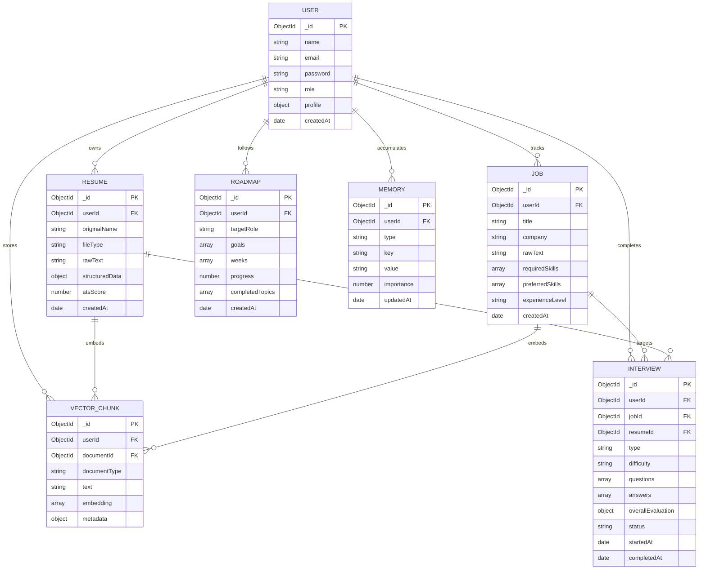

# Database Architecture & Schema Design

## 1. Overview & Storage Strategy

CareerAI uses **MongoDB** as its primary document database. MongoDB was selected for its native support for nested JSON schemas (ideal for complex AI evaluations and parsed resume sections) and high-throughput vector chunk lookups.

---

## 2. Entity-Relationship Diagram



---

## 3. Core Collection Schemas & Data Constraints

### 3.1 `users`
* `email`: Unique, lowercase, indexed string with RFC-5322 regex validation.
* `password`: Bcrypt hashed string with $\ge 10$ salt rounds (hidden by default via `select: false`).
* `profile`: Embedded document containing `targetRole`, `experienceLevel`, `skills`, and `bio`.

### 3.2 `resumes`
* `userId`: `Mongoose.Schema.Types.ObjectId` referencing `User` (Indexed).
* `rawText`: Normalized extracted text from PDF/DOCX.
* `structuredData`: Parsed contact info, education array, work experience array, technical skills array, and soft skills array.
* `atsScore`: Numerical score between $0$ and $100$.

### 3.3 `jobs`
* `userId`: Owner reference ensuring multi-tenant isolation.
* `requiredSkills`: Array of canonicalized skill strings.
* `preferredSkills`: Array of optional skill strings.
* `responsibilities`: Array of engineering deliverables.

### 3.4 `vectorchunks`
* `userId`: Tenant reference.
* `documentId`: Target resume or job ID.
* `documentType`: Enum (`'resume'`, `'job'`, `'project'`, `'interview'`).
* `text`: Chunked text slice ($500$ chars).
* `embedding`: Dense 768-dimensional float array.

### 3.5 `interviews`
* `type`: Enum (`'technical'`, `'behavioral'`, `'system_design'`, `'mern'`, `'fullstack'`, `'custom'`).
* `difficulty`: Enum (`'easy'`, `'medium'`, `'hard'`).
* `questions`: Array of personalized question objects with category tags.
* `answers`: Array of user responses with 6-dimensional AI evaluation scores.
* `overallEvaluation`: Aggregated scores and diagnostic hiring feedback.

---

## 4. Indexing & Query Optimization Strategy

To guarantee sub-5ms response times across all endpoints, the following compound and single indexes are active:

| Collection | Index Fields | Index Type | Purpose |
|---|---|---|---|
| `users` | `{ email: 1 }` | Unique B-tree | Fast login lookup & email uniqueness |
| `resumes` | `{ userId: 1, createdAt: -1 }` | Compound B-tree | Scoped user resume retrieval |
| `jobs` | `{ userId: 1, createdAt: -1 }` | Compound B-tree | Scoped user job postings list |
| `vectorchunks` | `{ userId: 1, documentType: 1 }` | Compound B-tree | Filtered semantic chunk retrieval |
| `interviews` | `{ userId: 1, status: 1 }` | Compound B-tree | Active vs completed interview listing |
| `memories` | `{ userId: 1, key: 1 }` | Compound B-tree | Fast mentor memory lookup & upsert |
| `roadmaps` | `{ userId: 1, targetRole: 1 }` | Compound B-tree | User roadmap progress queries |

---

## 5. Multi-Tenant Isolation & Cascading Cleanup

All controller queries enforce strict tenant scoping via `req.user._id`:
```javascript
// Strict Tenant Scoping Example
const resume = await Resume.findOne({ _id: req.params.id, userId: req.user._id });
if (!resume) {
  return res.status(404).json({ success: false, message: 'Resume not found' });
}
```
When a resume is deleted, a cascade hook automatically cleans up all associated records in `VectorChunk` to prevent orphaned data.
